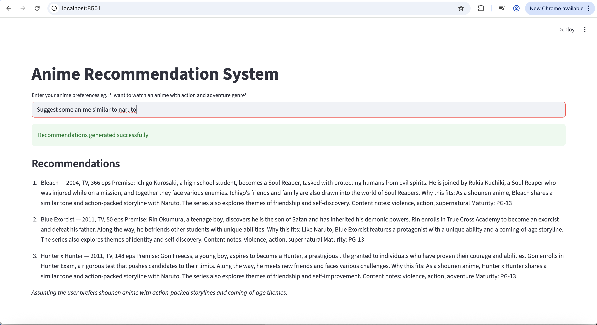

# Anime Recommender (RAG + LLM)

An end-to-end anime recommendation app that uses a local embedding model for retrieval and a hosted LLM (Groq) to generate tailored recommendations.

- **Retrieval:** `sentence-transformers` embeddings stored in `Chroma` vector DB.
- **LLM:** Groq `llama-3.1-8b-instant` via `langchain-groq`.
- **UI:** Streamlit app at `app/app.py`.

## Screenshot



Note: If the image doesn’t render, add a screenshot at `docs/screenshot.png` in this repo.

## Features

- **RAG pipeline:** CSV -> processed text -> chunks -> embeddings -> persistent Chroma store.
- **Prompting:** Curated prompt in `src/prompt_template.py` returns exactly 3 concise, spoiler-safe picks.
- **LLM reasoning:** Groq for fast, low-latency generation.
- **Streamlit UI:** Simple input → recommendations output.

## Tech Stack

- Python 3.10+
- LangChain (<0.3), LangChain Community (<0.3)
- Chroma
- sentence-transformers (Hugging Face)
- Streamlit
- Groq API

## Project Structure

- `app/` – Streamlit app entry (`app.py`).
- `src/` – Core modules (`data_loader.py`, `vector_store.py`, `prompt_template.py`, `recommender.py`).
- `pipeline/` – Build and runtime pipeline scripts (`build_pipeline.py`, `pipeline.py`).
- `config/` – Config and env loading (`config.py`).
- `utils/` – Logger and exception utilities.
- `data/` – Input CSV (`anime_with_synopsis.csv`) and processed CSV output.
- `logs/` – Daily log files.
- `chroma_db/` – Persistent Chroma store (gitignored).
- `Dockerfile`, `k8s-manifest.yaml`, `monitoring-values.yaml` – Container and ops.

## Prerequisites

- Python 3.10+ and `pip`
- Groq API key

Create `.env` (or update as needed):

```
GROQ_API_KEY="<your_groq_api_key>"
# Optional if you use gated HF models
HUGGINGFACEHUB_API_TOKEN="<your_hf_token>"
```

## Setup

```bash
python -m venv venv
source venv/bin/activate           # macOS/Linux
# .\\venv\\Scripts\\activate     # Windows PowerShell

python -m pip install --upgrade pip
python -m pip install -e .

# Build the vector store (reads CSV, processes, embeds, persists Chroma)
python3 pipeline/build_pipeline.py
```

## Run the App

```bash
streamlit run app/app.py
```

The app will be available at `http://localhost:8501`.

Tip: To silence tokenizers warning

```bash
export TOKENIZERS_PARALLELISM=false
```

## Docker

Build and run:

```bash
docker build -t anime-recommender:latest .
docker run --rm -p 8501:8501 --env-file .env anime-recommender:latest
```

## Kubernetes (example)

1) Build and push your image to a registry you control, then update `image:` in `k8s-manifest.yaml`.

2) Create secrets for environment variables referenced by the Deployment (`envFrom.secretRef: llmops-secrets`):

```bash
kubectl create secret generic llmops-secrets \
  --from-literal=GROQ_API_KEY="<your_groq_api_key>"
```

3) Deploy:

```bash
kubectl apply -f k8s-manifest.yaml
```

## Monitoring (Grafana k8s monitoring)

```bash
helm repo add grafana https://grafana.github.io/helm-charts && \
  helm repo update && \
  helm upgrade --install --atomic --timeout 300s grafana-k8s-monitoring grafana/k8s-monitoring \
    --namespace "monitoring" --create-namespace --values monitoring-values.yaml
```

## Troubleshooting

- **No such command 'app/app.py':** Use `streamlit run app/app.py`.
- **LangChain import errors:** This project pins `langchain<0.3`, `langchain-community<0.3`. Ensure dependencies match; reinstall with `pip install -e .`.
- **Chroma deprecation warning:** Consider switching to `langchain-chroma` later.
- **pandas `error_bad_lines` removed:** Use `on_bad_lines="skip"` (already applied).

## Repository

- Remote: `git@github.com-saurabhsingh:saurabhsingh121/anime-recommender.git`

---

Feel free to open issues/PRs for improvements.